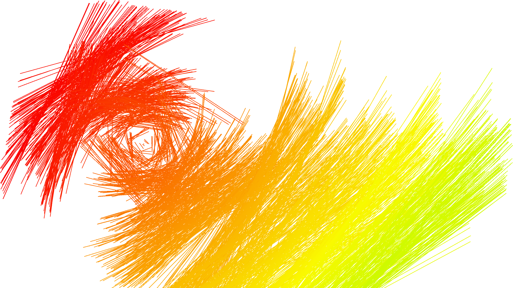
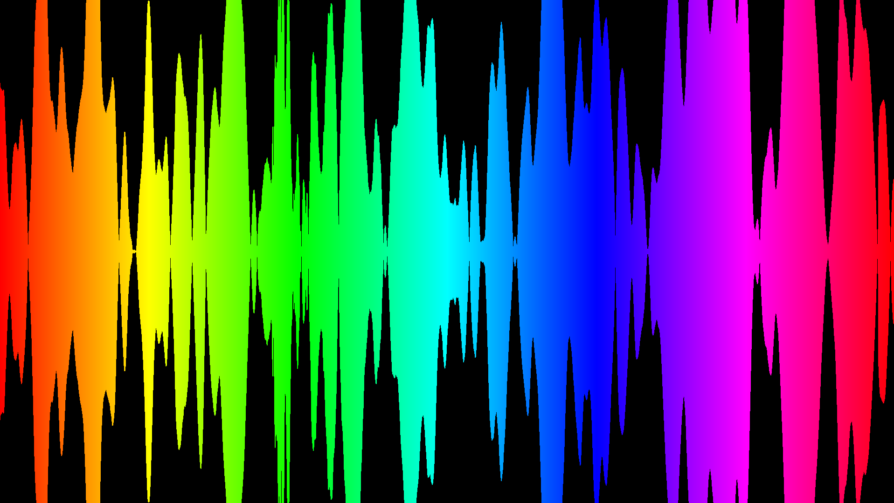
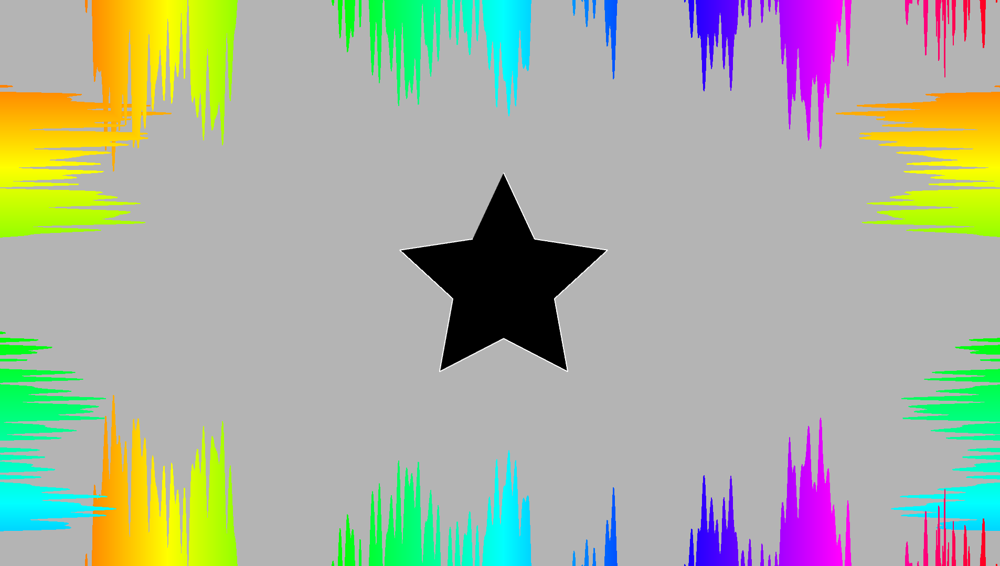
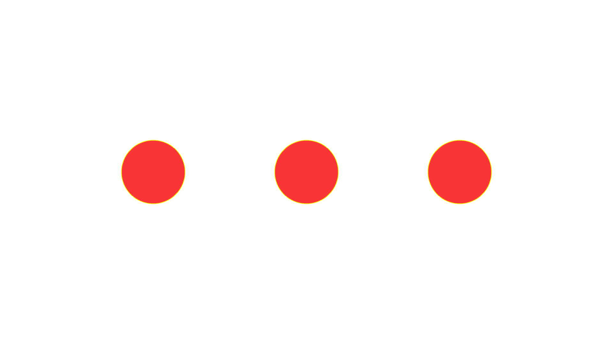
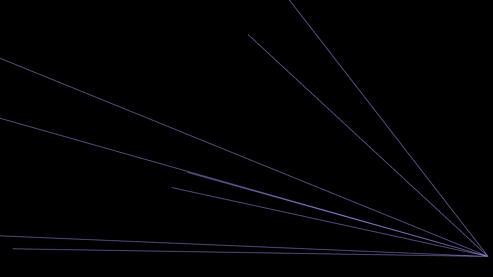
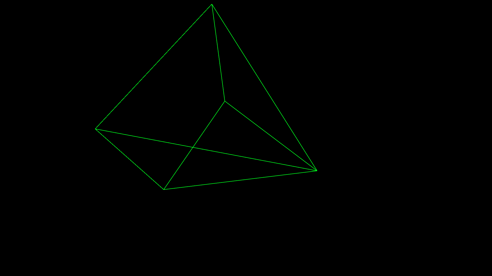
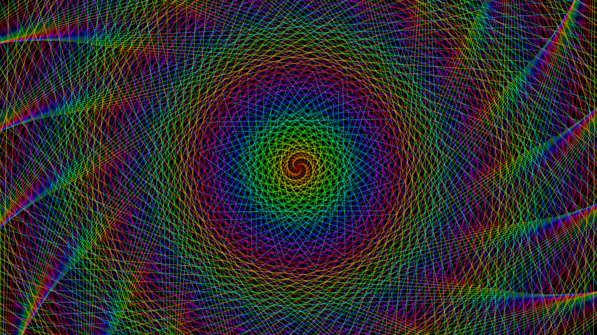

# Music Visualiser Project

Name: Christina Alferieva

Student Number: C19401882

## Instructions
- Fork this repository and use it a starter project for your assignment
- Create a new package named your student number and put all your code in this package.
- You should start by creating a subclass of ie.tudublin.Visual
- There is an example visualiser called MyVisual in the example package
- Check out the WaveForm and AudioBandsVisual for examples of how to call the Processing functions from other classes that are not subclasses of PApplet

# Description of the assignment
For my OOP assignment I had to create a game or a visual art piece that fits the quote "Something beautiful to enjoy while listening to music." I wanted to make a visual experience, that a user could relax to while listening to and enjoying some music. The song I chose was "Your Love" by A7S, ATB and Topic. I chose it because after hearing it play on the radio I could already envision all the fun visuals and art I could create. I thought it was the perfect fit for this assignment. I made sure to include lots of colours, patterns and different 2D and 3D shapes. I have some relaxing and calming visuals for the slower parts of the song, and more entertaining and fun visuals and patterns for when the beat drops or the song speeds up. These visuals react to the music and change when keys 0 - 6 pressed. 


# Instructions
- To stop the music and visuals press the "spacebar".

- To play the music and visuals press the "spacebar".

- To switch to the first visual press "0".

- To switch to the second visual press "1".

- To switch to the third visual press "2".

- To switch to the fourth visual press "3".

- To switch to the fifth visual press "4".

- To switch to the sixth visual press "5".

- To switch to the seventh visual press "6".

- When on visual "6", you can also press key "UP" to switch to another visual.

# How it works


# What I am most proud of in the assignment
What I am most proud of in my assignment is the star shape in the Visual "2" and my ability to keep going and not give up. The star reacts to the music by expanding and contracting to the beat. This semester was my first time coding in Java, and after attending all lectures and labs I was able to see my coding skills improve. However, I still struggled with many things such as mapping, and getting the coordinates of shapes and objects correct. I also found it very difficult to make sure all the visuals react correctly to the music. After many different attempts to make the star sit in the center and pulse to the music, I was finally proud of what I created. I'm proud that I was able to keep going through the difficulty. Through looking back on many lectures and tutorials and wtaching different Youtube videos, I finally created the visual I had in mind for a long time. This star visual stood out to me as even after being stuck on it, through research and not giving up I got it completed. I was also very proud of the overall outcome of my program. 
This is the code of the star visual that I am proud of. 

```Java
translate(width / 2, height / 2, 50 + (lerpedAverage * 3000));
beginShape();
fill(255, 204, 0);
stroke(255);
strokeWeight(2);
vertex(0, -50);
vertex(14, -20);
vertex(47, -15);
vertex(23, 7);
vertex(29, 40);
vertex(0, 25);
vertex(-29, 40);
vertex(-23, 7);
vertex(-47, -15);
vertex(-14, -20);
endShape(); 
```

*Visual 0:* Iterates over all the elements in the audio buffer and forms this beautiful pattern that pulses and changes to the music.



*Visual 1:* Also iterates over all the elements in the audio buffer and shows the beat of the music along a horizontal line in the centre.



*Visual 2:* This visual shows the beat of the music in little pulses all around the screen with a big black star in the centre. The star also expands and contracts to the music.



*Visual 3:* As the music becomes louder and faster, in this visual three red circles on a white background pulse.



*Visual 4:* In this visual there are 8 blue lines that move and interchange from one angle to the beat of the song.



*Visual 5:* When key 5 is chosen there are two visuals. The first one is a 3D pyramid that rotates and pulses to the music. When the key "UP" is pressed it forms two 3D cubes also rotating and pulsing to the beat.




*Visual 6:* This visual forms a beautiful pattern that changes and moves as the song goes on. There are many intricate patterns which form and rotate. 




My Youtube link:
- https://youtu.be/-1TtDx_KYmI

[](https://youtu.be/-1TtDx_KYmI)


# Markdown Tutorial

This is *emphasis*

This is a bulleted list

- Item
- Item

This is a numbered list

1. Item
1. Item

This is a [hyperlink](http://bryanduggan.org)

# Headings
## Headings
#### Headings
##### Headings

This is code:

```Java
public void render()
{
	ui.noFill();
	ui.stroke(255);
	ui.rect(x, y, width, height);
	ui.textAlign(PApplet.CENTER, PApplet.CENTER);
	ui.text(text, x + width * 0.5f, y + height * 0.5f);
}
```

So is this without specifying the language:

```
public void render()
{
	ui.noFill();
	ui.stroke(255);
	ui.rect(x, y, width, height);
	ui.textAlign(PApplet.CENTER, PApplet.CENTER);
	ui.text(text, x + width * 0.5f, y + height * 0.5f);
}
```

This is an image using a relative URL:


This is an image using an absolute URL:


This is a youtube video:


https://youtu.be/-1TtDx_KYmI

[](https://www.youtube.com/watch?v=J2kHSSFA4NU)

This is a table:

| Heading 1 | Heading 2 |
|-----------|-----------|
|Some stuff | Some more stuff in this column |
|Some stuff | Some more stuff in this column |
|Some stuff | Some more stuff in this column |
|Some stuff | Some more stuff in this column |

